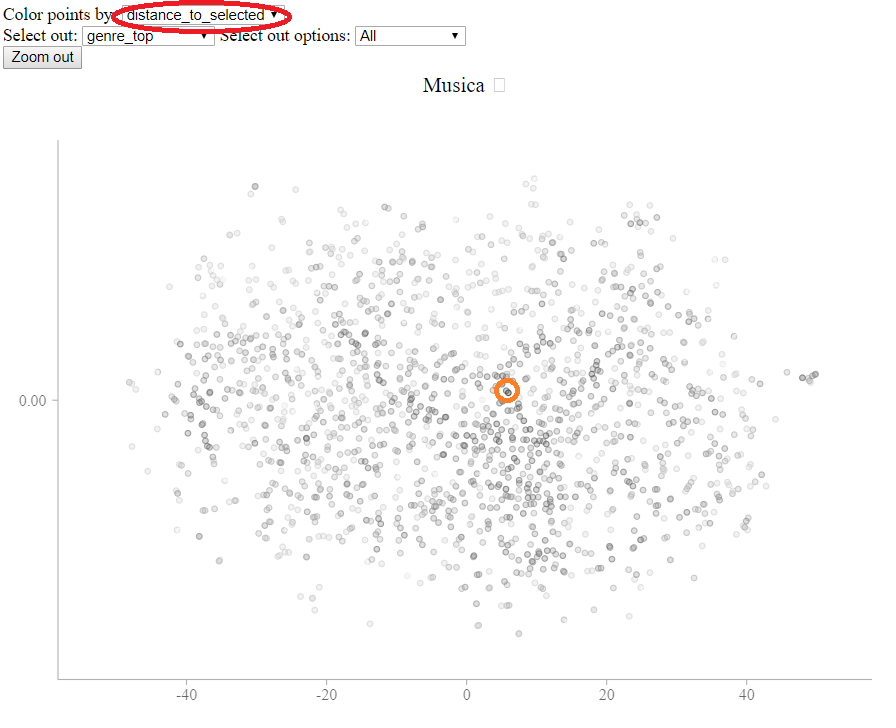
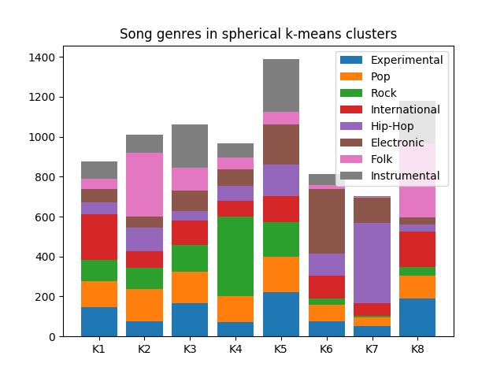
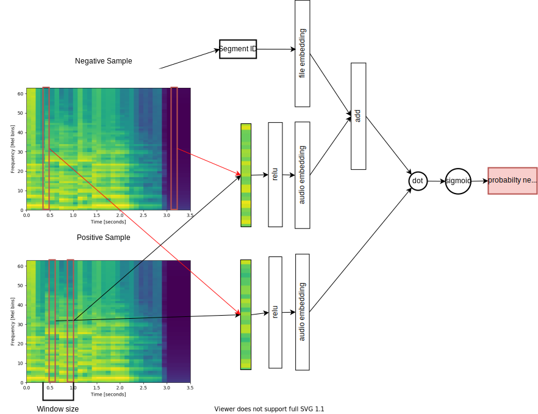

# sound-eval

This repository contains command line tools to process audio files (in mp3 or wav formats) into vector embeddings, and some tools to make use of those embeddings. Its most significant result right now is an interactive distance display deployed [here](https://s3-us-west-2.amazonaws.com/fma-dataset-embeddings/display_template.html), and described in more detail in the examples section of this readme.

## Results of processing the FMA dataset

The FMA dataset is a dataset composed of songs posted with liberal licenses on the [Free Music Archive website](http://freemusicarchive.org/). Link to dataset: https://github.com/mdeff/fma

The following results are on the smallest dataset provided, fma_small.zip, composed of 8000 30s song clips taken from 8 genres.

### t-SNE visualization

After training, I fed the resulting song vectors into my `static_web_viewer/display_vector_data.py` tool, which gives the following output

[Link to interactive display](https://s3-us-west-2.amazonaws.com/fma-dataset-embeddings/display_template.html)

This display is produced using a t-SNE embedding with a cosine distance matrix.  

There are two interesting features of this display. One is that you can see general clusters of genres that emerge from the t-SNE pprojection. You can play individual songs to see what the difference is between borders of these clusters vs the center.

Since the t-SNE projection removes the vast majority of the distance information, I added an additional feature that brings back all the distance information.

If you change the "Color points by" option to "distance_to_selected" (circled below), the points will be colored by distance to the selected point. In this screenshot, the point with an orange circle (added for effect) was clicked on.

This shows that close points are spread across the display, allowing you to compare more carefully different areas of the map by hand.

### Spherical k-Means classification

One standard thing to do with embeddings is to run k-means to cluster them, and examine the clusters to see if they make sense to humans. In the given bar plot, the x axis shows the contents of 8 different clusters formed by a k-means.

This plot shows some promising results. For example, some genres, such as hip-hop, rock, and electronic are concentrated mostly in one or two clusters. The genres which are more spread out, like experimental, pop, and international, are by their nature more difficult  genres to classify.  You can try it yourself, by clicking on songs in the interface, and trying to classify them into these 8 genres, and seeing if you guess is right.

Even more promising is looking at which genres overlap significantly. Note that the clusters with the two largest concentrations of Folk have the smallest concentrations of Electronic. This confirms the intuition that Electronic and Folk music are difficult to confuse.

## Usage information

### Installing

System libraries: ffmpeg, sox

    sudo apt-get install ffmpeg
    sudo apt-get install sox # only needed to process wav files

Python libraries: numpy, soundfile, tensorflow, matplotlib pyyaml

    pip install numpy soundfile tensorflow matplotlib pyyaml

Make sure to install tensorflow-gpu if you want to use a gpu.

Note that some of the post-processing tools have dependencies of their own that also need to be installed if you wish to use them.

### High level usage information

It takes a few steps to processing raw files into something useful. A high level description of those steps is here. API details are in the files themselves, and can be seen by calling the files directly with no arguments or with a -h.

#### Preprocessing

Preprocess the audio files into lists of [mel scale](https://en.wikipedia.org/wiki/Mel_scale) frequency vectors. This is done with the `process_many_files.py` tool, which converts a nested folder of sound files (wav or mp3) into the same nested structure, but with .npy files (which contain a list of FFT vectors).

example:

    python spectrify_all.py example_input/ example_vectors/ --config=configs/small_train.yaml

#### Training

Training is done by the `spectrogram_doc2vec.py` file. This file takes in the folder of vectors produced by the preprocessing, and trains the model on those vectors. Note that training operates on an infinite loop with no cutoff, so make sure to cancel the operation when loss as printed starts to flatten. The output folder saves the state of training so training can be easily restarted by rerunning the command with the same output folder.

    python spectrogram_doc2vec.py example_vectors/ example_outs/ --config=configs/small_train.yaml

#### Output folder details

The output folder has a lot of files. You mostly need to know about the first two files in this list to use all the tools. Most of the tools pick out these files automatically, but a few don't for increased flexibility.

* `vector_at_{x}.npy`, is the song level vectors saved at iteration `num`
* `music_list.txt` stores the filenames of the vectors in the same order as the vectors are stores in `vector_at_{x}.npy`. This is the **only** reliable way of matching up vectors to their original document.
* `weights` folder holds the wegiths for the model. This is only saved for the very last iteration, so it **will not** necessarily correspond in any meaningful way to `vector_at_{x}.npy` unless `num` is the very maximum (the one stored in `epoc_num.txt`).
* `epoc_num.txt` stores the last iteration number, or the number at which the `weights` were saved. Needed to correctly match up `weights` and vectors (used by `calc_all_vecs.py` for instance).  
* `config.yaml` is a copy of the configuration file that was used. Useful for reproducibility reasons.
* `cost_list.csv` stores the cost at different iterations as the model is trained. Useful for examining long runs.

### Postprocessing

The resulting vectors can be used for many tasks. There are several options for processing the output vectors already implemented in the repository.

* Constructing an interactive display for the sound file embeddings. `static_web_viewer/display_vector_data.py`
* Using supervised SVMs to classify the songs based on their vector, and a labeled training dataset: `process_results/logistic_regress.py`
* Automatically create categories of sound with spherical k-means, and compare those categories to labeled categories. `process_results/sphere_kmeans.py`

Examples of these are listed below:

## Model

This model is inspired by Thomas Miktov's work on word-to-vec and doc-to-vec. These two natural language processing models, distributed through popular distributions like gensim, are still quite popular today, especially among a more applied research community. This is despite these methods being crushed on basically every relevant benchmark they have been applied to in 2017 and 2018.

The reason they remain popular, despite their low performance on benchmarks is:

* Incredible training speed on large datasets (still far exceeding competitors)
* The ability to use embedding vectors easily and effectively in old, well understood, and extremely accessible methods such as k-means, t-SNE, and logistic regression.
* The linear algebraic relations among words such as the famous `King - man + woman = Queen` relation.

I hope to bring these properties to the audio processing world to make audio processing as easy, fast and well understood as natural language processing using word-to-vec and doc-to-vec.

### Relevant literature

Audio processing has lately been tied closely to computer vision.
So closely in fact, that one significant paper sponsored by Google, "CNN Architectures for Large-Scale Audio Classification", applies several state of the art image classification architectures, and apply them (with minor tweaks) directly to audio classification (the two dimensions in audio processing are time and spectrogram bin).

So it should not be surprising that someone already had an idea very close to mine in the computer vision world. It is called "Learning visual groups from co-occurrences in space and time", and its bibtex citation is at the bottom of this section.

This paper proposes a number of techniques using their method which also apply to my model, and they do a more through literature review,  deeper explanation of their technique, and larger list of possible applications than I cover here, and in general it is vastly superior research, so I suggest checking it out.

    @article{DBLP:journals/corr/IsolaZKA15,
      author    = {Phillip Isola and
                   Daniel Zoran and
                   Dilip Krishnan and
                   Edward H. Adelson},
      title     = {Learning visual groups from co-occurrences in space and time},
      journal   = {CoRR},
      volume    = {abs/1511.06811},
      year      = {2015},
      url       = {http://arxiv.org/abs/1511.06811},
      archivePrefix = {arXiv},
      eprint    = {1511.06811},
      timestamp = {Mon, 13 Aug 2018 16:48:47 +0200},
      biburl    = {https://dblp.org/rec/bib/journals/corr/IsolaZKA15},
      bibsource = {dblp computer science bibliography, https://dblp.org}
    }

## Model

### Context dependence problem.

To get an embedding, we need some unsupervised problem to train it on. The basic problem selected by me and word-to-vec is the context dependence problem.

The context dependence problem is the problem of whether two different segments of data appear in the same local context. The key here is that a piece of information (in this case a sound spectrum) informs something about nearby (in this case temporally nearby) pieces of information.

More mathematically, we can describe two sets of data:

* Global context set: All pairs of data, `( A, B )`
* Local context set: All pairs of data, `( A, B )` such that `A` and `B` are nearby (in this case within a certain temporal distance from each other).

The idea is that these sets are different, and that a neural network can often tell which sets a given element is from by looking at the values of the data.

### Embedding

Note that the Context dependence problem is a binary decision problem. Either a pair of data is in the global context set or the local context set.

A traditional binary classification network, although it can get extremely good performance on the training task, and the resulting embeddings sometimes contain useful information and have useful properties, the embeddings do not have all of the good properties that make word-to-vec so useful.

Instead, we intentionally cripple the architecture to force the features to appear in a neatly analytical nature. There are two key aspects to the architecture.

1. Information separation. Although the training task is on pairs of data, the actual output should be an embedding of a single piece of data. Since the embedding will just be a layer in the neural network, then the information of the pairs must be kept separate until the layer the embedding is taken from.
2. Embedding value independence. In order to have the linear property, and have a reasonable distance metric that k-means and t-SNE can work with out of box, each scalar value in the embedding vector have a certain kind of independence from the others values. Not independent of inputs, but independence of outputs, i.e., the training cost should depend on each element independently.

These two needs, plus a more technical investigation into word-to-vec, results in a binary classification probability.

`P((A,B) from global context) = sigoid(embedding_1 * embedding_2)`

Where

    embedding_1 = neural_net_1(A)
    embedding_2 = neural_net_2(B)

Here, `*` entails the vector dot product, which is exactly the sort of linear, independent, but powerful operation we are looking for and sigmoid is great for binary classification.

### Distributed embedding

Taking a page from Thomas Miktov's word-to-vec, we create a distributed song level embedding by simply adding on a vector that is unique for each song. i.e., change the probability function to

`P((A,B) from global context) = sigoid((embedding_1+song_vector) * embedding_2)`

Where the `song_vector` is the vector of the song that `embedding_1` comes from. Note that if `(A,B)` is taken from the global set, then it will probably not be from the same song as `embedding_2`, but if it is taken from the local set,

Note that since the cost function is no longer symetric between `A` and `B`, `neural_net_1` and `neural_net_2` should learn different weights.

Like in doc-to-vec, this entails that there needs to be a training step when inferring what the song vector should be.
