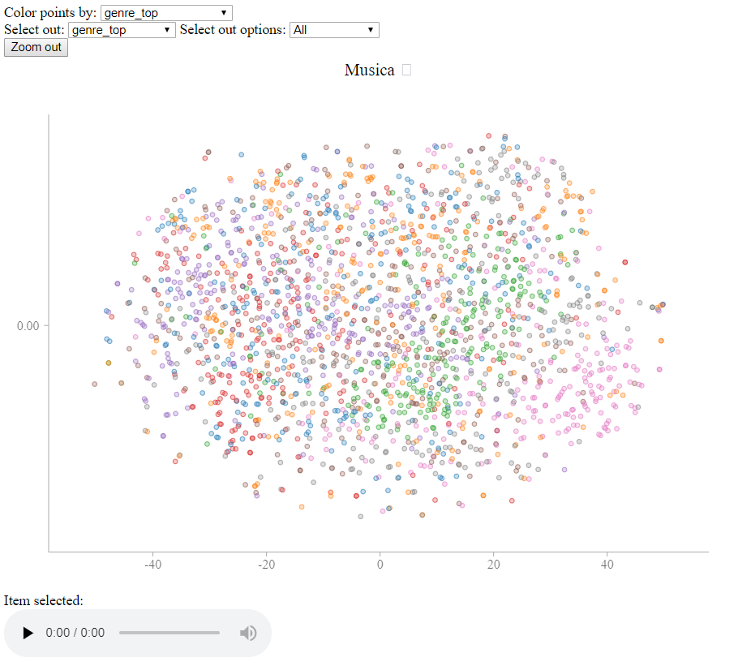

# sound-eval

This repository contains command line tools to process audio files (in mp3 or wav formats) into vector embeddings, and some tools to make use of those embeddings.

### Installing

System libraries: ffmpeg, sox

    sudo apt-get install ffmpeg
    sudo apt-get install sox # only needed to process wav files

Python libraries: numpy, soundfile, tensorflow, matplotlib pyyaml

    pip install numpy soundfile tensorflow matplotlib pyyaml

Make sure to install tensorflow-gpu if you want to use a gpu.

Note that some of the post-processing tools have dependencies of their own that also need to be installed if you wish to use them.

### High level usage information

It takes a few steps to processing raw files into something useful. A high level description of those steps is here. API details are in the files themselves, and can be seen by calling the files directly with no arguments or with a -h.

#### Preprocessing

Preprocess the audio files into lists of [mel scale](https://en.wikipedia.org/wiki/Mel_scale) frequency vectors. This is done with the `process_many_files.py` tool, which converts a nested folder of sound files (wav or mp3) into the same nested structure, but with .npy files (which contain a list of FFT vectors).

example:

    python spectrify_all.py example_input/ example_vectors/ --config=configs/small_train.yaml

#### Training

Training is done by the `spectrogram_doc2vec.py` file. This file takes in the folder of vectors produced by the preprocessing, and trains the model on those vectors. Note that training operates on an infinite loop with no cutoff, so make sure to cancel the operation when loss as printed starts to flatten. The output folder saves the state of training so training can be easily restarted by rerunning the command with the same output folder.

    python spectrogram_doc2vec.py example_vectors/ example_outs/ --config=configs/small_train.yaml

#### Output folder details

The output folder has a lot of files. You mostly need to know about the first two files in this list to use all the tools. Most of the tools pick out these files automatically, but a few don't for increased flexibility.

* `vector_at_{x}.npy`, is the song level vectors saved at iteration `num`
* `music_list.txt` stores the filenames of the vectors in the same order as the vectors are stores in `vector_at_{x}.npy`. This is the **only** reliable way of matching up vectors to their original document.
* `weights` folder holds the wegiths for the model. This is only saved for the very last iteration, so it **will not** necessarily correspond in any meaningful way to `vector_at_{x}.npy` unless `num` is the very maximum (the one stored in `epoc_num.txt`).
* `epoc_num.txt` stores the last iteration number, or the number at which the `weights` were saved. Needed to correctly match up `weights` and vectors (used by `calc_all_vecs.py` for instance).  
* `config.yaml` is a copy of the configuration file that was used. Useful for reproducibility reasons.
* `cost_list.csv` stores the cost at different iterations as the model is trained. Useful for examining long runs.

### Postprocessing

The resulting vectors can be used for many tasks. There are several options for processing the output vectors already implemented.

* Constructing an interactive display for the sound file embeddings. `static_web_viewer/display_vector_data.py`
* Using supervised SVMs to classify the songs based on their vector, and a labeled training dataset: `process_results/logistic_regress.py`
* Automatically create categories of sound with spherical k-means, and compare those categories to labeled categories. `process_results/sphere_kmeans.py`

Examples of these are listed below:

## Successful Examples on the FMA dataset

The FMA dataset is a dataset composed of songs posted with liberal licenses on the [Free Music Archive website](http://freemusicarchive.org/). Link to dataset: https://github.com/mdeff/fma

The following results are on the smallest dataset provided, fma_small.zip, composed of 8000 30s song clips taken from 8 genres.

### t-SNE visualization

After training, I fed the resulting song vectors into my `static_web_viewer/display_vector_data.py` tool, which gives the following output

[Link to interactive display](https://s3-us-west-2.amazonaws.com/fma-dataset-embeddings/display_template.html)

This display is produced using a t-SNE embedding with a cosine distance matrix.  

There are two interesting features of this display. One is that you can see general clusters of genres that emerge from the t-SNE pprojection. You can play individual songs to see what the difference is between borders of these clusters vs the center.

Since the t-SNE projection removes the vast majority of the distance information, I added an additional feature that brings back all the distance information.

If you change the "Color points by" option to "distance_to_selected" (circled below), the points will be colored by distance to the selected point. In this screenshot, the point with an orange circle (added for effect) was clicked on.

This shows that close points are spread across the display, allowing you to compare more carefully different areas of the map by hand.

### Spherical k-Means classification

One standard thing to do with embeddings is to run k-means to cluster them, and examine the clusters to see if they make sense to humans. In the given bar plot, the x axis shows the contents of 8 different clusters formed by a k-means.

This plot shows some promising results. For example, some genres, such as hip-hop, rock, and electronic are concentrated mostly in one or two clusters. The genres which are more spread out, like experimental, pop, and international, are by their nature more difficult  genres to classify.  You can try it yourself, by clicking on songs in the interface, and trying to classify them into these 8 genres, and seeing if you guess is right.

Even more promising is looking at which genres overlap significantly. Note that the clusters with the two largest concentrations of Folk have the smallest concentrations of Electronic. This confirms the intuition that Electronic and Folk music are difficult to confuse.
